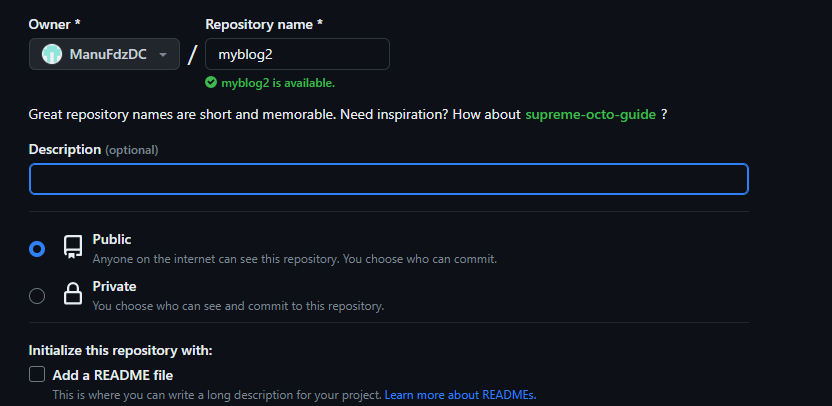
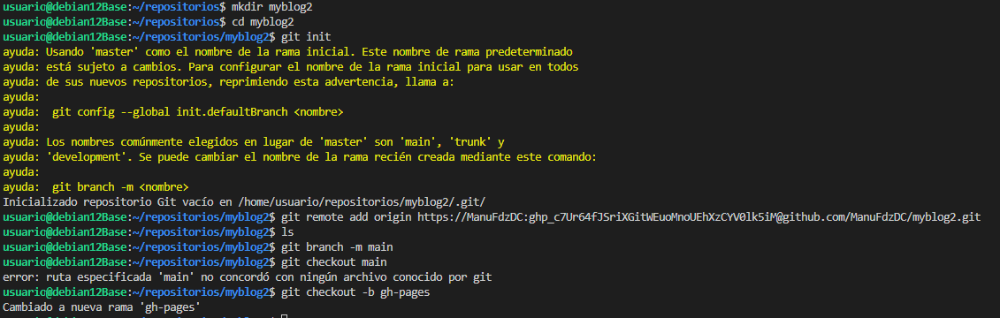
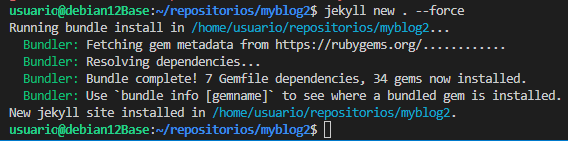
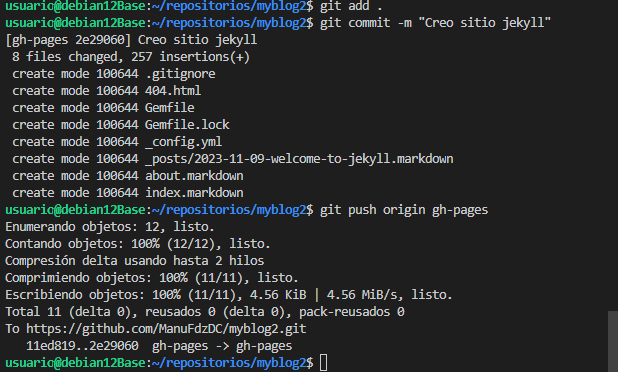
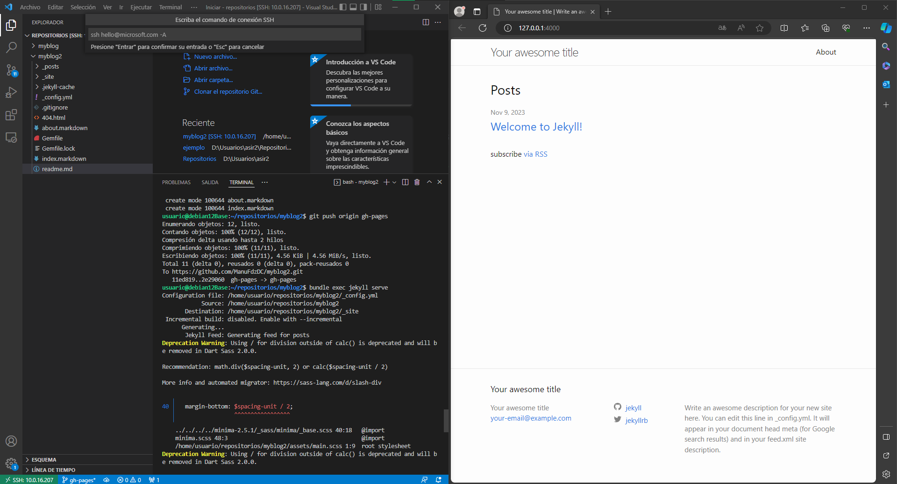
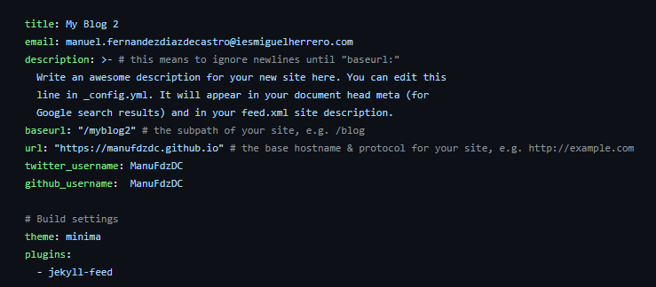
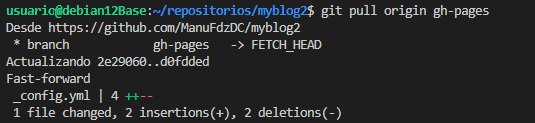

# Sitio Jekyll
## Manuel Fernández Díaz de Castro

- Creamos el repositorio en GitHub
  

- Creamos el repositorio en local, lo sicnronizamos con el de GitHub y cambiamos el nombre de la rama principal de master a main. Creamos la rama gh-pages que es en la que se almacenara toda la pagina web.
  

- Creamos un sitio jekyll en el repositorio.
  

- Hacemos git add, git commit y git push para guardar los cambios y subirlo al repositorio remoto de GitHub.
  

- Ejecutamos el sitio jekyll y verificamos que funciona en local.
  

- Modificamos el archivo _config.yml para cambiar los datos personales desde GitHub.

Hacemos git pull para traer los cambios hechos online a local.
